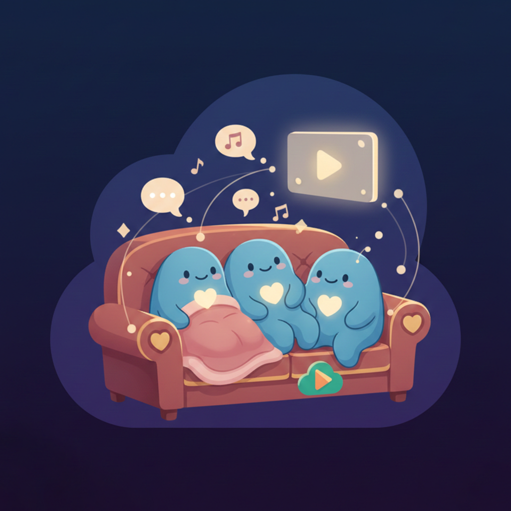

<div align="center">
  
  <h1>Emotional</h1>
  <p><strong>A modern, highly scalable Flutter application featuring real-time WebRTC communication, synchronized media playback, and a secure Firebase-powered backend.</strong></p>

  <p>
    <a href="https://flutter.dev/"></a>
    <a href="https://dart.dev/"></a>
    <a href="https://firebase.google.com/"></a>
    <a href="https://webrtc.org/"></a>
    <a href="LICENSE"></a>
  </p>
</div>

---

## 📖 About Emotional

**Emotional** is an open-source social media and synchronized video-watching platform built with Flutter. It allows users to create virtual rooms, invite friends, and watch videos together completely in sync while simultaneously interacting via real-time WebRTC video and audio calls.

Whether it's watching a movie from Google Drive, streaming from YouTube, or playing a local file, Emotional keeps everyone in the room perfectly synchronized.

---

## ✨ Features

- 🎥 **Synchronized Video Playback:** Watch videos together with friends. Play, pause, and seek events are instantly synced across all peers in the room.
- 📞 **Real-Time Video & Audio Calls:** Built-in P2P communication powered by WebRTC.
- 📁 **Multiple Media Sources:** Support for local files, direct URLs, YouTube streams, and Google Drive integrations.
- 💬 **Live Chat:** Real-time text messaging within the virtual rooms.
- 🛋️ **Dynamic Layouts:** Choose between different viewing experiences:
  - **Armchair Mode:** A cozy setup representing virtual seats.
  - **Cinema Mode:** Focus entirely on the video with a cinematic layout.
  - **Split Mode:** Perfectly balance the video player and your friends' webcam feeds.
- 🔗 **Deep Linking:** Seamlessly invite users directly into rooms using custom URLs (e.g., `emotional://join/{roomId}`).
- 🔒 **High Security:** Deeply integrated environment obfuscation ensures no API keys are ever exposed in the repository or compiled code.
- 🌍 **Localization:** Multi-language support out of the box (English & Turkish).

---

## 🛠 Why These Technologies? (Under The Hood)

For developers exploring our codebase, we carefully selected our tech stack to ensure high performance, maintainability, and scalability. Here is a breakdown of **what** we used and **why**:

| Technology | Package | Why we use it |
| :--- | :--- | :--- |
| **State Management** | [`flutter_bloc`](https://pub.dev/packages/flutter_bloc) & `equatable` | Provides a strict, predictable state container. It separates business logic from the UI, making the app highly testable and easy to maintain as complexity grows. |
| **Video Player** | [`media_kit`](https://pub.dev/packages/media_kit) | The most powerful, cross-platform video player for Flutter. It uses native hardware acceleration and supports almost every codec, which is crucial for a media-heavy application. |
| **Real-time Comms** | [`flutter_webrtc`](https://pub.dev/packages/flutter_webrtc) | Enables low-latency, peer-to-peer audio and video streaming without routing heavy media traffic through a central server, significantly reducing backend costs. |
| **Backend & Signaling**| [`firebase_database`](https://pub.dev/packages/firebase_database) | We use Firebase Realtime Database as our signaling server for WebRTC (exchanging SDP offers, answers, and ICE candidates) as well as for managing room states and live chat with low latency. |
| **Security** | [`envied`](https://pub.dev/packages/envied) | Open-source apps are vulnerable to key scraping. Envied compiles our `.env` variables into obfuscated Dart code, ensuring API keys are never leaked in the repo or easily reverse-engineered from the binary. |
| **Background Tasks** | [`background_downloader`](https://pub.dev/packages/background_downloader) | Allows robust downloading of large video files from Google Drive even when the app is moved to the background, preventing interrupted downloads. |

---

## 🏗 Architecture & Folder Structure

This project follows a hybrid of **Clean Architecture** and **Feature-First** design patterns. This ensures that features are isolated, decoupled, and easy to work on for multiple contributors without causing merge conflicts.

```text
lib/
├── core/             # Universal, app-independent services (Network watcher, Cache, Permissions)
├── features/         # Feature-based modular structure
│   ├── app.dart      # Main app entry structure
│   ├── auth/         # Authentication flows (Google Sign-In implementation)
│   ├── call/         # WebRTC Signaling, PeerConnection, and Media Devices management
│   ├── chat/         # In-room messaging logic
│   ├── home/         # Dashboard, Deep Links handler, permission verifications
│   ├── room/         # The most complex module: Room state, synchronized playback, dynamic layouts
│   └── video_player/ # MediaKit UI integration, PiP (Picture-in-Picture), player overlays
├── product/          # App-specific UI kits, themes, constants, and generated assets
└── main.dart         # Clean entry point
```

### Layer Responsibilities:
1.  **Core (`core/`)**: Completely independent of specific business logic. Contains generalized solutions (e.g., `PermissionService` with strict mutex locks to prevent overlapping permission dialogs) that can be dragged and dropped into any other Flutter project.
2.  **Product (`product/`)**: Contains logic and widgets specific to *this* app but used globally. We avoid polluting `main.dart` by keeping initialization logic (Theme, App-specific widgets, initializers) inside `product/init/`.
3.  **Features (`features/`)**: Driven by business logic. Every capability is isolated. Inside a feature, we separate the UI (`presentation/`), State Management (`bloc/`), and Logic (`domain/` & `data/`).

---

## 🚀 Getting Started

Want to run Emotional locally or contribute? Follow these steps to build the project.

### 📋 Prerequisites
- [Flutter SDK](https://docs.flutter.dev/get-started/install) (^3.10.4)
- A [Firebase](https://console.firebase.google.com/) account (Required to act as your backend/signaling server).

### 1️⃣ Clone the Repository
```bash
git clone https://github.com/cengizhankkaya/emotional.git
cd emotional
```

### 2️⃣ Install Dependencies
```bash
flutter pub get
```

### 3️⃣ Setup Environment Variables (Critical)
Because this project is open-source, API keys are completely stripped from the repository. You must create your own `.env` files for the app to compile.

1. Navigate to the `assets/` folder and create an `env` directory:
   ```bash
   mkdir -p assets/env
   ```
2. Create two files inside `assets/env/`: `.env` (for dev) and `.prod.env` (for production).
3. Add your required API variables to both files. 
   ```env
   BASEURL=https://your-api-url.com
   # Add any other keys required by lib/product/init/config/app_enviroment.dart
   ```
4. Run the build runner to generate the obfuscated configuration files securely:
   ```bash
   dart run build_runner build --delete-conflicting-outputs
   ```
   *Note: If successful, files like `dev_env.g.dart` will be generated.*

### 4️⃣ Setup Firebase
You need to connect the app to your own Firebase project for Auth and WebRTC signaling to function.
1. Create a project on the [Firebase Console](https://console.firebase.google.com/).
2. Enable **Google Sign-In** in the Authentication tab.
3. Create a **Realtime Database** (Start in Test Mode or configure proper rules).
4. Use the [FlutterFire CLI](https://firebase.google.com/docs/flutter/setup) to automatically configure your active project:
   ```bash
   dart pub global activate flutterfire_cli
   flutterfire configure
   ```

### 5️⃣ Run the App
```bash
flutter run
```

---

## 🤝 Contributing

Emotional is built by and for the open-source community. If you are learning Flutter, WebRTC, or Clean Architecture, this is a great place to start!

1. Fork the Project
2. Create your Feature Branch (`git checkout -b feature/AmazingFeature`)
3. Commit your Changes (`git commit -m 'Add some AmazingFeature'`)
4. Push to the Branch (`git push origin feature/AmazingFeature`)
5. Open a Pull Request

**Coding Standards:** Please adhere to the internal folder structure. Use BLoC for state management additions, and try to keep your presentation layers dumb and logic-less. Always run `flutter format` before committing your PR.

---

## 📜 License

Distributed under the MIT License. See the [LICENSE](LICENSE) file for more information.

---

<div align="center">
  <b>Built with ❤️ by Cengizhan KAYA</b><br>
  <i>Open Source for the Flutter Community</i>
</div>
